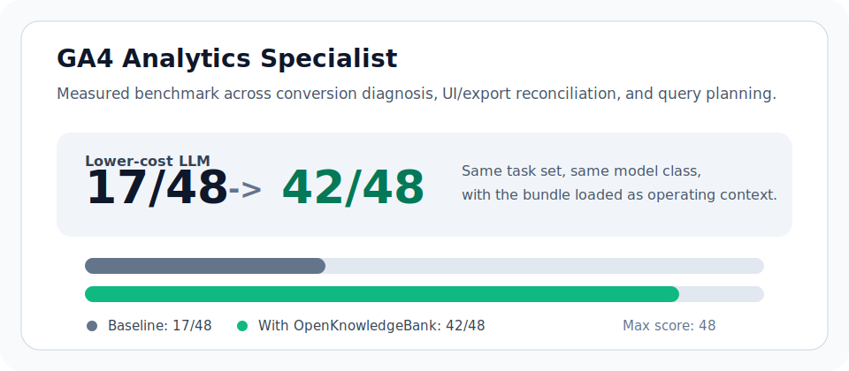

# OpenKnowledgeBank

[](https://openknowledgebank.com)
[](LICENSE.md)
[](LICENSE-CODE.md)

Portable, inspectable knowledge bundles for LLM agents.

OpenKnowledgeBank gives agents role knowledge, workflows, safety rules, deliverable formats, commands, examples, and evaluations as plain markdown directories that can be reused across tools and models.

Use it when you want an agent to do specialized work with better structure, clearer source discipline, and more reusable operating guidance than a one-off prompt.

**Status:** early public preview. The first measured benchmark bundle is GA4 Analytics Specialist.

**Star this repo to follow the open library of reusable agent knowledge bundles.**

## Measured Proof

The first measured benchmark bundle is [GA4 Analytics Specialist](bundles/roles/ga4-analytics-specialist). In a three-task GA4 evaluation, the same lower-cost model improved from a baseline score of `17/48` to an OpenKnowledgeBank-assisted score of `42/48`.



| Model class | Baseline | With OpenKnowledgeBank | Max score |
| --- | ---: | ---: | ---: |
| Lower-cost LLM | 17 | 42 | 48 |
| General-purpose LLM | 25 | 46 | 48 |
| Reasoning LLM | 31 | 47 | 48 |

The benchmark covers conversion-drop diagnosis, GA4 UI vs BigQuery reconciliation, and GA4 BigQuery query planning. It is an early public proof point, not a universal claim about every model or task.

## Try It In 60 Seconds

Copy a bundle into your project or point your agent at it directly:

```text
Use the OpenKnowledgeBank bundle at bundles/roles/ga4-analytics-specialist
as operating guidance for this GA4 analysis task. Follow its workflows,
safety boundaries, deliverable formats, commands, and evaluation criteria.
Do not claim access to GA4, BigQuery, GTM, ads, or backend orders unless
the user provides data or explicitly authorizes tool access.
```

Useful starting files:

- [registry/bundles.json](registry/bundles.json): machine-readable bundle catalog.
- [AGENT_USAGE.md](AGENT_USAGE.md): guidance for agents consuming bundles.
- [bundles/roles/ga4-analytics-specialist/index.md](bundles/roles/ga4-analytics-specialist/index.md): entry point for the measured GA4 bundle.
- [docs/BUNDLE_SCHEMA.md](docs/BUNDLE_SCHEMA.md): current working bundle schema.

## Available Bundles

| Bundle | Use it for | Status | Evidence |
| --- | --- | --- | --- |
| [GA4 Analytics Specialist](bundles/roles/ga4-analytics-specialist) | GA4 analysis, ecommerce diagnosis, BigQuery export planning, UI/export reconciliation | Candidate / measured | `17/48` baseline to `42/48` bundle-assisted |
| [Performance Marketer](bundles/roles/performance-marketer) | Campaign diagnosis, paid acquisition context, marketing workflows | Seed skeleton | Planned after the GA4 benchmark |

## What Is Inside A Bundle?

Bundles are plain markdown directories with YAML frontmatter. Depending on the bundle type, they may include:

- role definitions and responsibilities
- operating principles and safety boundaries
- workflows, playbooks, and frameworks
- tool guidance and source requirements
- deliverable formats and quality bars
- commands and skill suggestions
- examples, references, and evaluations

Bundles can represent roles, industries, capabilities, tools, frameworks, compliance regimes, jurisdictions, deliverables, and datasets.

## Who This Is For

- Agent builders who want reusable domain knowledge instead of long prompt fragments.
- Teams evaluating whether specialized context improves agent output quality.
- Contributors who want to publish practical, inspectable knowledge for AI-assisted work.
- Tool builders who need a simple catalog format for agent-ready knowledge bundles.

## Contribute

OpenKnowledgeBank is free to use, inspect, remix, and contribute to.

Good contributions improve bundle quality, add useful role knowledge, strengthen evaluations, improve registry metadata, or make bundles easier for agents and humans to use.

Start with:

- [CONTRIBUTING.md](CONTRIBUTING.md)
- [docs/BUNDLE_CREATION_PROCESS.md](docs/BUNDLE_CREATION_PROCESS.md)
- [docs/BUNDLE_SCHEMA.md](docs/BUNDLE_SCHEMA.md)

## Repository Structure

```text
bundles/
  roles/
  industries/
  capabilities/
  tools/
  frameworks/
  compliance/
  jurisdictions/
  deliverables/
  datasets/
registry/
schemas/
tools/
examples/
docs/
```

## License

Knowledge bundles, documentation, and examples are licensed under [Creative Commons Attribution 4.0 International](LICENSE.md).

Code and tooling are licensed under [MIT](LICENSE-CODE.md).
